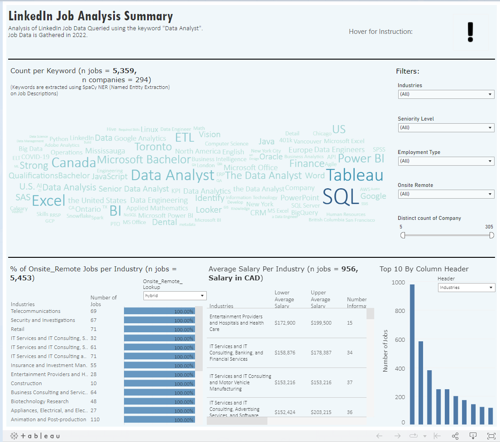

## Linkedin Job Data Analysis

Analysis of Linkedin Job Data for Data Analyst Positions available in the US and Canada in 2022.

**Tableau Workbook:** [linkedin_job_connected_data_workbook.twbx](linkedin_job_connected_data_workbook.twbx)

**My Tableau Vizzes for LinkedIn Job Data Analysis:** 
- [LinkedIn Job Analysis Summary](https://public.tableau.com/app/profile/hai.ran.zheng/viz/linkedin_job_analysis/LinkedInJobAnalysisSummary)
- [Bigram/Trigram Analysis](https://public.tableau.com/views/linkedin_job_bigram_trigram_analysis/LinkedInJobDescriptionBigramTrigramAnalysis?:language=en-US&:display_count=n&:origin=viz_share_link)

## Repository Items
All ETL operations (Cleaning Data, Exploration, Writing to Bigquery tables) are done in [linkedin-job-data-exploration.ipynb](linkedin-job-data-exploration.ipynb)

CSV files found in [linkedin-data-analyst-jobs-listings-csv](linkedin-data-analyst-jobs-listings-csv)

setup_notebook.ipynb in PlotLee_Mini is a mini framework I use myself to improve efficiency in plotting visualizations: [Setup Notebook Link](PlotLee_Mini/setup_notebook.ipynb)

[report_files](report_files) contains basic data exploration report files.

[useful_code_functions](useful_code_functions) store some library functions that I commonly used in analyzing LinkedIn Data, such as
SpaCY Tokens, and bigquery client functions to write data to Bigquery.

[wandb](wandb) some run files that produced wandb dashboards for me to explore data. 

